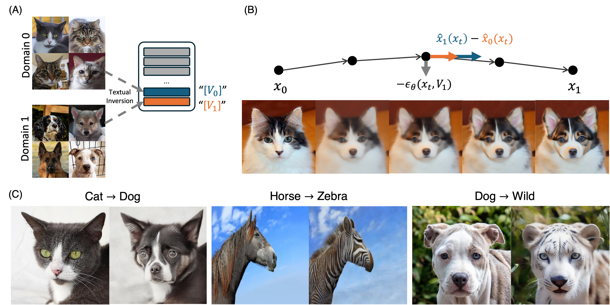
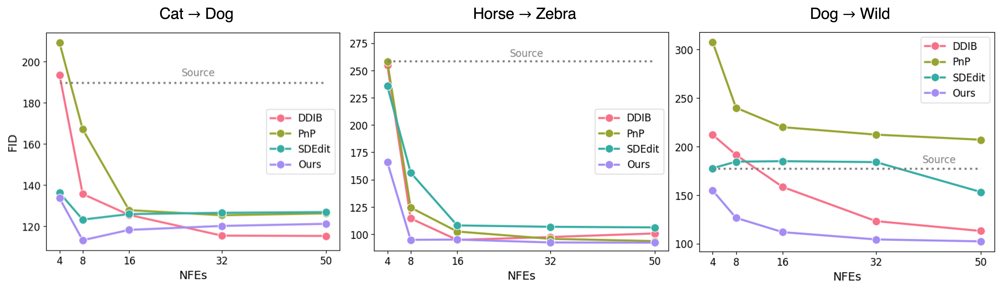

# Latent Schodinger Bridge: Prompting Latent Diffusion for Fast Unpaired Image-to-Image Translation



This is an official pytorch implementation of LatentDB. Under blind-review.


## Abstract
Diffusion models (DMs) have inspired powerful unpaired image-to-image translation algorithm,
because it enable both image generation from noise and inversion from data.
However, **they often requires a large number of neural function evaluations (NFEs).**

In this paper, we analyze the PF-ODE formulation of Schrodinger Bridges (SB),
which are SDEs between distributions with minimal transport cost, and observe that
we can decompose the vector field into a linear combination of three interpretable components.

With prompt optimization and appropriate change of variables, we propose **LatentSB that approximate the SB ODE via pre-trained Stable Diffusion.**
We demonstrate that our algorithm successfully conduct competitive I2I translation in unsupervised setting
with only a fraction of computation cost required by previous DM-based I2I method.

## Results


We evaluate FID on translated images from baseline methods with various NFEs. For small NFE ≤ 10, LSB ODE outperforms baselines and the quality is improved or maintained with more NFEs. For more results and analysis, please refer to the paper.


## Getting Started

### Environment Setting
```
git clone https://github.com/LatentSB/LatentSB.git
cd LatentSB
conda env create -f environment.yaml
conda activate latentsb
```

📝 We are using diffusers for Stable Diffusion and its scheduler. Depending on the version of diffusers, outputs may vary slightly.

### Quick Start (Dog $\rightarrow$ Wild)
```
python sample.py --embedding_ckpt_0 embeddings/dog_1_0.pt --embedding_ckpt_1 embeddings/wild_1_0.pt
```

You will get the same result as shown here:


### Textual Inversion
This paper assume the unsupervised setting, indicating paired dataset and text description for each domain are not given. Thus, we optimize text embedding for each domain to compute source and target predictors.

```
python textual_inversion.py --root "<directory of images>" --name "<name of domain>"
```

Detailed arguments:

```
--root (str)        : Directory of image
--workdir (str)     : Save directory
--num_epochs (int)  : Number of epochs
--placeholder (str) : Text to be optimized (e.g. "*")
--init (str)        : Initial prompt (e.g. "a photo")
--save_freq (int)   : Optimization iteration to save
--eval_freq (int)   : Optimization iteration to evaluate
--name (str)        : Name of the domain
```

### Image-to-Image Translation

Using optimized prompts, we can conduct various DM-based I2I translation algorithms.

```
python sample.py --embedding_ckpt_0 "<path to checkpoint>" --embedding_ckpt_1 "<path to checkpoint>" --prompt_0 "a photo of a !" --prompt_1 "a photo of a *" --root "<directory of source images>" --method "<name of algorithm>"
```


Detailed argument:
```
--embedding_ckpt_0 (str)    : Path to source prompt embedding
--embedding_ckpt_1 (str)    : Path to target prompt embedding
--prompt_0 (str)            : Source prompt 
--prompt_1 (str)            : Target prompt
--root (str)                : Directory of source images
--workdir (str)             : Save directory
--method (str)              : Translation algorithm
--tau (float)               : Standard Deviation of LSB
--t0 (float)                : Start time of LSB ODE
--scale (float)             : CFG scale
--NFE (int)                 : Number of Neural Function Evalutions
--seed (int)                : Random seed
```

Note that, `--tau` in this code is $\sqrt{\tau}$ in the paper.

For the method, we provide DDIB, SDEdit and LSB ODE (ours).
You can use them by setting
- `--method dual` : DDIB
- `--method sdedit` : SDEdit
- `--method lsb` : LSB ODE (proposed)

In case of PnP, we modify the official repository to load learned text embeddings.

